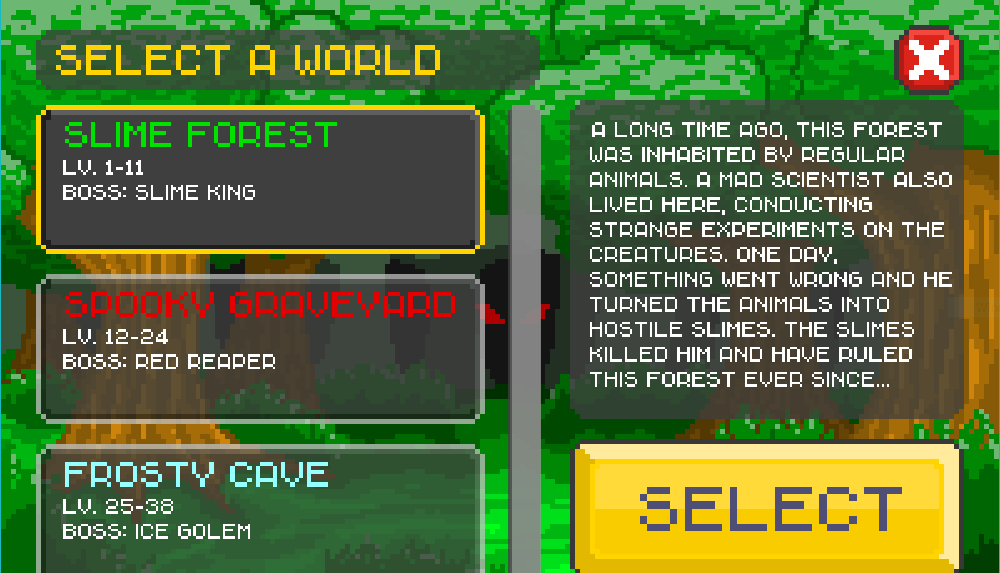
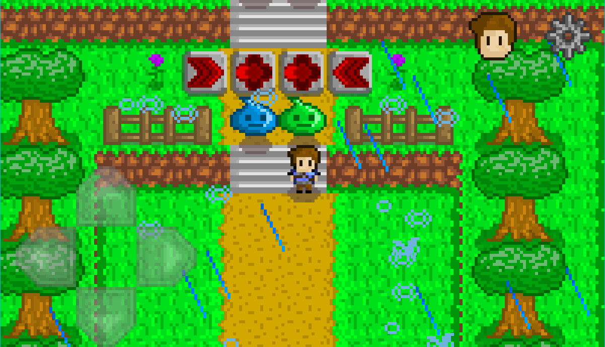
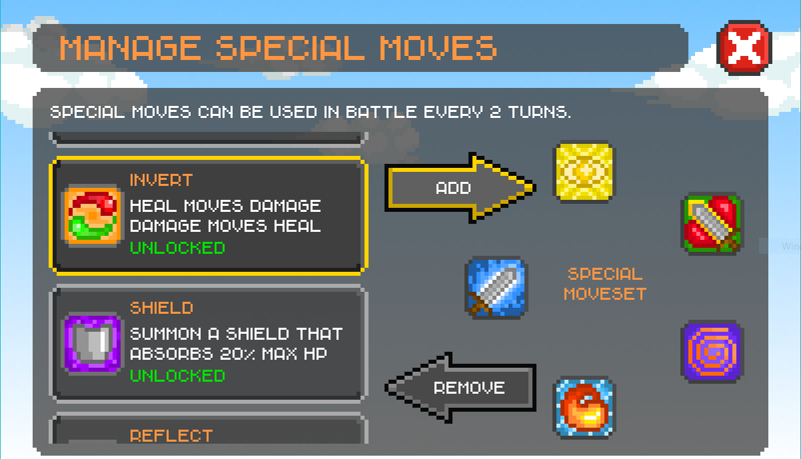

# Unlucky AE

Unlucky AE now supports [GraalVM](https://www.graalvm.org/) native-image!

Unlucky AE is a fork of [Unlucky](https://github.com/mingli1/Unlucky), just for bug fixes.  
This project's name meant **Unlucky (Anyi's Edition)**.

Unlucky is a 2D RPG Game powered by Java & libGDX. Based on RNG (Random Number Generator) with a turn-based battle system. RNG is usually frowned upon in games, but this game's entire theme is RNG. Everything from attacks in battle to item enchanting to movement is based on RNG. 

    
    

## About

The player ventures and battles monsters in maps with various themes. Currently there are three available worlds all with 10+ levels in each world. In these maps, the player will have to defeat monsters and find a star tile to complete the level. Monsters may drop items that can improve the player's strength. These items may be sold in the shop for gold or enchanted to increase their power. There are currently 100+ items dropped by monsters and sold in the shop.

The battle system is based on turn-based mechanics. The player is given four randomly generated moves with each color corresponding to a different type of move. The player also has access to special moves that they can choose in the menu. Special moves give bonus effects to the player's attacks or affects the enemy. The player also has an option to run from the battle at a very low chance of success.

## Downloads
This fork's releases can be found on [GitHub Releases](https://github.com/anyicomplex/unlucky-ae/releases).  
You can also play this fork online at [GitHub Page](https://anyicomplex.github.io/unlucky-ae).

Official releases for Desktop are found on [this](https://github.com/mingli1/Unlucky/releases). It is in a runnable .jar format so you must have JRE installed.
Note: running the official game on desktop will create a `save.json` file in the same directory as the game. The game must be run in the same directory as the save.json to work and load your progress.

Official game also available for free on the [Google Play Store](https://play.google.com/store/apps/details?id=com.unlucky.main).

The assets for this game are also available for download:
* [Textures](https://github.com/mingli1/Unlucky/files/2300518/textures.zip) (contains a file `textures.png` that has all the textures in the game mapped into an atlas `textures.atlas`).
* [Skins](https://github.com/mingli1/Unlucky/files/2300523/skins.zip) (contains LibGDX Skins of the game).
* [Music](https://github.com/mingli1/Unlucky/files/2300525/music.zip) (all music in the game in `.ogg` format).
* [Sound Effects](https://github.com/mingli1/Unlucky/files/2300530/sfx.zip) (all sfx in the game mostly in `.ogg` format).

## Credits
* Programming - Originally by [Ming Li](https://github.com/mingli1) using Java & [libGDX](https://libgdx.com/). Modified by [Yi An](https://github.com/anyicomplex).
* Artwork - [Ming Li](https://github.com/mingli1), using [Paint.net](https://www.getpaint.net/) and textures packed using [Gdx Texture Packer GUI](https://github.com/crashinvaders/gdx-texture-packer-gui).
* Music - [Ming Li](https://github.com/mingli1) using [Bosca Cecilo](https://boscaceoil.net/).
* Sound Effects - all sound effects are under [CC0](https://creativecommons.org/share-your-work/public-domain/cc0/) from [Freesound](https://freesound.org/) and edited by [Ming Li](https://github.com/mingli1) using [Audacity](https://www.audacityteam.org/).

## License
This fork is licensed under the [GPL-3.0 License](https://github.com/anyicomplex/unlucky-ae/blob/master/LICENSE).

Official project is licensed under the [MIT License](https://github.com/anyicomplex/unlucky-ae/blob/master/Unlucky-LICENSE).

## Screenshots

    
    

    
    

    
    

    

